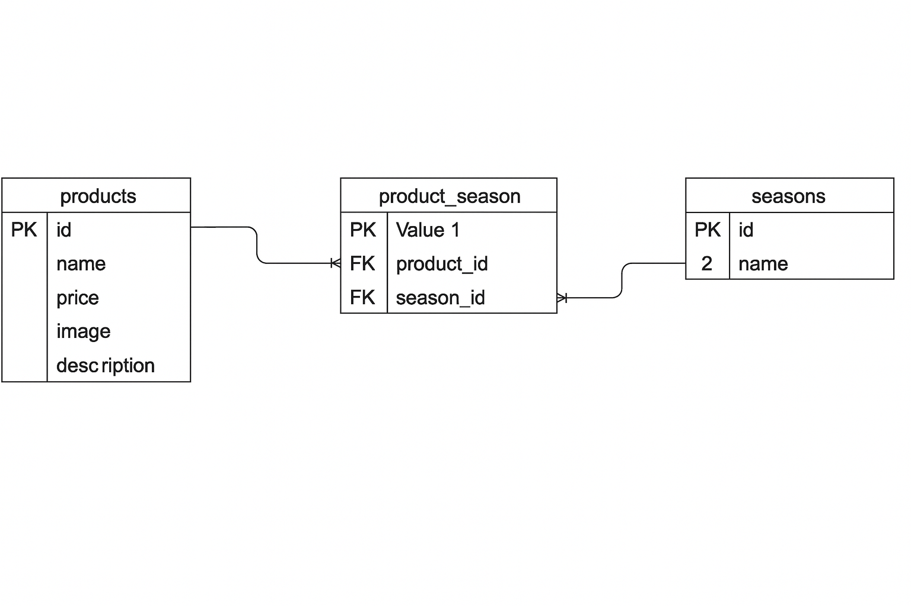

🚀 環境構築手順　 Git Cloneでリポジトリを取得 
git clone git@github.com:sub-law/coachtech-test-02.git

🚀１：リポジトリ名変更  "任意のファイル名"

githubでリモートリポジトリの url を変更 ローカルリポジトリから紐付け先を変更 
cd "任意のファイル名" 
git remote set-url origin githubで作成したリポジトリのurl 
git remote -v

現在のローカルリポジトリのデータをリモートリポジトリに反映 
git add . 
git commit -m "リモートリポジトリの変更" 
git push origin main

🚀2：Laravel環境構築 
## 必要なディレクトリの作成（初回セットアップ時）

1:Laravelの一部コマンド実行には、以下のディレクトリが必要です。  
Gitでは空フォルダが追跡されないため、`.gitkeep` を配置しておくか、以下のコマンドで作成してください。

mkdir -p src/storage/framework/cache/data
mkdir -p src/storage/framework/sessions
mkdir -p src/storage/framework/views
mkdir -p src/storage/logs

touch src/storage/framework/cache/.gitkeep
touch src/storage/framework/sessions/.gitkeep
touch src/storage/framework/views/.gitkeep
touch src/storage/logs/.gitkeep 

2：プロジェクト直下に.envを作成（既にファイルがあり以下の記述があれば不要）
touch .env

3：.envに以下を記述（UID/GIDはホストOSのユーザーIDに合わせて設定）
UID=1000
GID=1000

4：Docker ビルド 
docker-compose up -d --build

5：PHPコンテナに入る 
docker-compose exec php bash

6：Composer インストール 
composer install

7：.env 作成 
cp .env.example .env

8：アプリキー生成 
php artisan key:generate

9：データベースの作成（マイグレーション） 
php artisan migrate

10：ダミーデータの作成 
php artisan db:seed

11：ストレージとのリンク
php artisan storage:link

12：PHPコンテナから出る　Ctrl+D

ER図

関連リンク

商品一覧：http://localhost/products
商品登録：http://localhost/products/create

データベース：http://localhost:8080/

🧪 使用技術 php:8.1-fpm
Laravel Framework 8.83.8
MySQL 8.0.26